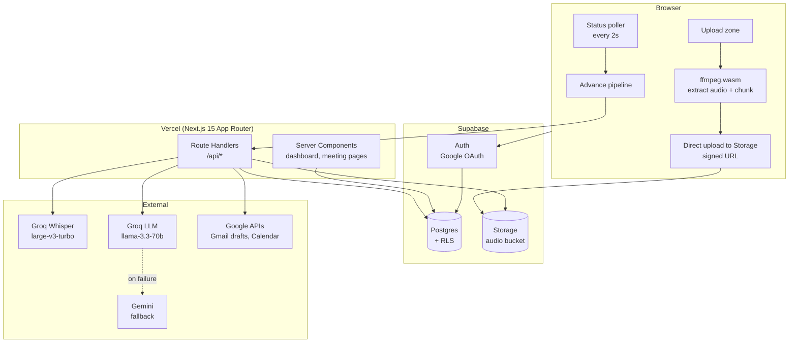
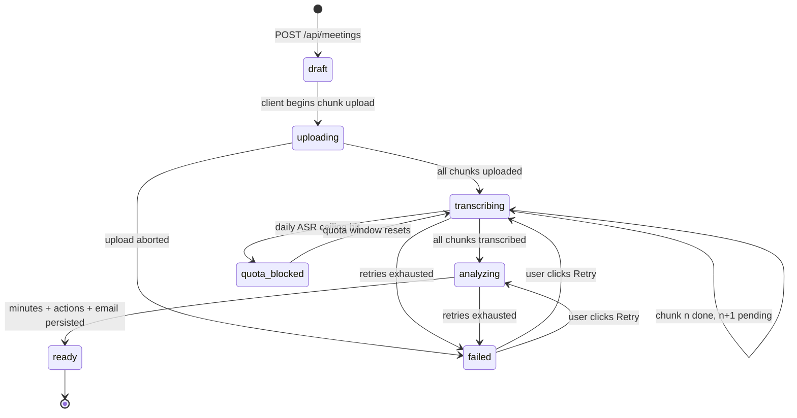
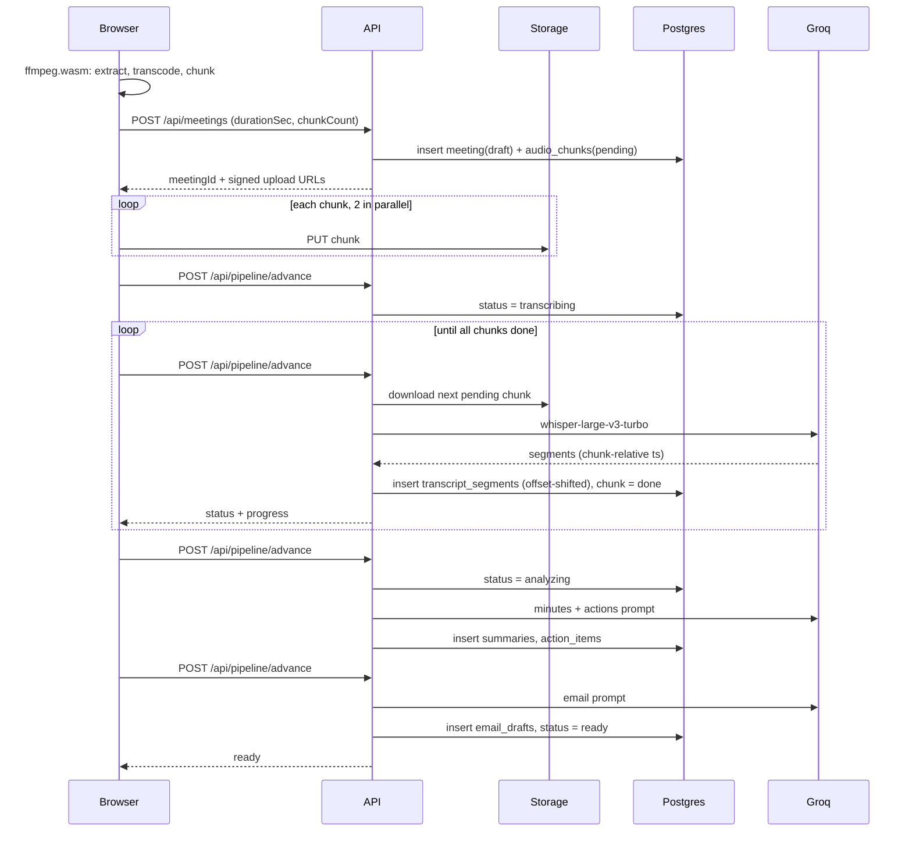

# SyncMind — Architecture

## 1. Guiding constraints

Every structural decision below traces back to one of these:

| Constraint | Source | Consequence |
| --- | --- | --- |
| 60s max serverless execution | Vercel Hobby | No long-running request. Pipeline split into resumable stages, each under 60s. |
| 25 MB max audio per request | Groq ASR | Client chunks audio into ~10-minute segments before upload. |
| Daily request/token ceilings | Groq free tier | Quota tracking, graceful queueing, model fallback. |
| 1 GB object storage | Supabase free | 7-day audio retention, then auto-purge. |
| 500 MB Postgres | Supabase free | Transcripts stored as rows but text-compacted; no blob duplication. |
| Project pauses after 7 idle days | Supabase free | GitHub Actions cron pings the DB every 3 days. |
| No always-on worker process | zero cost | "Queue" is a Postgres table polled by the client and advanced by short serverless calls. |

## 2. System overview



## 3. The processing pipeline

### 3.1 Why it is client-driven

There is no free always-on worker. Instead: the browser holds a poll loop that (a) reads status and (b) calls a short "advance" endpoint that performs exactly one unit of work and returns. Each unit fits comfortably inside 60s.

If the user closes the tab, work pauses — it does not fail. State is entirely in Postgres. Reopening the meeting resumes from the last completed unit. A meeting stuck in a non-terminal state for over 10 minutes is picked up by a daily GitHub Actions sweep that advances it.

### 3.2 State machine



`meetings.status` holds this enum. `meetings.stage_detail` holds a human string ("Transcribing chunk 3 of 5") rendered directly in the UI.

### 3.3 Unit-of-work breakdown

| Unit | Trigger | Work | Typical duration |
| --- | --- | --- | --- |
| Create | User submits upload form | Insert `meetings` row (`draft`), insert one `audio_chunks` row per planned chunk, return signed upload URLs | < 1s |
| Upload chunk | Client, parallel ×2 | Browser PUTs chunk directly to Supabase Storage. Never proxied through Vercel. | seconds–minutes, off-server |
| Transcribe chunk | `POST /api/pipeline/advance` | Fetch one `pending` chunk, stream it to Groq Whisper, write `transcript_segments` with offsets shifted by chunk start, mark chunk `done` | 5-20s per 10-min chunk |
| Analyze | `POST /api/pipeline/advance` when all chunks done | Assemble full transcript, run the minutes+actions prompt, validate JSON, persist `summaries` + `action_items` | 10-40s |
| Draft email | `POST /api/pipeline/advance` after analyze | Run email prompt, persist `email_drafts` | 5-15s |

`/api/pipeline/advance` is idempotent: it takes a meeting id, inspects state, does the single next thing, and returns the new state. Calling it twice concurrently is guarded by a Postgres advisory lock keyed on the meeting id; the loser returns immediately with the current state.

### 3.4 Client chunking

Done with `ffmpeg.wasm` in a Web Worker:

1. Probe duration. Reject over 2 hours at MVP.
2. If the file is video, extract the audio track only.
3. Transcode to 16 kHz mono Opus in a WebM container — roughly 12 KB/s, so a 10-minute chunk is about 7 MB, safely under the 25 MB cap and cheap on storage.
4. Split on 10-minute boundaries with a 3-second overlap; the overlap is used to stitch segments and de-duplicate the repeated words at the seam.
5. Compute each chunk's start offset in seconds; timestamps returned by Whisper are chunk-relative and get shifted server-side.

If `ffmpeg.wasm` fails to load (old browser, blocked WASM), fall back: upload the original file if it is under 20 MB, otherwise show an explicit "please compress this file first" error with instructions. No silent failure.

## 4. Application structure

```
syncmind/
├── app/
│   ├── (marketing)/
│   │   └── page.tsx                  Landing
│   ├── (app)/
│   │   ├── layout.tsx                Authed shell: sidebar, user menu
│   │   ├── dashboard/page.tsx        Meeting list
│   │   ├── upload/page.tsx           Upload + chunking UI
│   │   ├── actions/page.tsx          Cross-meeting kanban
│   │   ├── settings/page.tsx         Google connections, retention, profile
│   │   └── meetings/[id]/
│   │       ├── page.tsx              Shell + status poller
│   │       ├── minutes/page.tsx
│   │       ├── transcript/page.tsx
│   │       ├── actions/page.tsx
│   │       ├── email/page.tsx
│   │       └── ask/page.tsx
│   ├── share/[token]/page.tsx        Public read-only view
│   ├── auth/callback/route.ts        Supabase OAuth callback
│   └── api/                          see §5
├── components/
│   ├── ui/                           shadcn primitives
│   ├── upload/                       Dropzone, ChunkProgress
│   ├── meeting/                      TranscriptList, MinutesEditor,
│   │                                 ActionTable, EmailComposer, AskPanel,
│   │                                 AudioPlayer, StatusStepper
│   └── actions/                      KanbanBoard, ActionCard
├── lib/
│   ├── supabase/                     browser.ts, server.ts, admin.ts, types.ts
│   ├── ai/                           groq.ts, gemini.ts, prompts/, schemas.ts,
│   │                                 chunk-transcribe.ts, analyze.ts, ask.ts
│   ├── audio/                        ffmpeg-worker.ts, chunker.ts, stitch.ts
│   ├── google/                       oauth.ts, gmail.ts, calendar.ts
│   ├── pipeline/                     advance.ts, state.ts, locks.ts
│   ├── export/                       markdown.ts, ics.ts, srt.ts
│   └── quota.ts                      free-tier accounting
├── supabase/migrations/              numbered SQL files
├── docs/
└── .github/workflows/                keepalive.yml, sweep.yml, ci.yml
```

**Rules.** Server Components read data directly through the server Supabase client; no `/api` round-trip for reads the page owns. Route handlers exist for mutations, external API calls, and anything needing a secret. Secrets (`GROQ_API_KEY`, `SUPABASE_SERVICE_ROLE_KEY`, Google client secret) are referenced only inside `app/api/**` and `lib/**` modules imported by them — never in a `"use client"` file.

## 5. API contracts

All routes require an authenticated Supabase session unless marked public. All return `{ error: { code, message } }` with a non-2xx status on failure.

### Meetings

**`POST /api/meetings`** — create a meeting and reserve chunk slots.
```jsonc
// request
{ "title": "Q3 Planning", "durationSec": 2732, "chunkCount": 5, "mimeType": "audio/webm" }
// response 201
{ "meetingId": "uuid",
  "chunks": [{ "index": 0, "startSec": 0, "uploadUrl": "https://...", "path": "..." }] }
```

**`GET /api/meetings/:id/status`** — poll target. Cheap, no joins beyond counts.
```jsonc
{ "status": "transcribing", "stageDetail": "Transcribing chunk 3 of 5",
  "chunksDone": 3, "chunksTotal": 5, "error": null }
```

**`PATCH /api/meetings/:id`** — rename, pin (opt out of auto-purge).
**`DELETE /api/meetings/:id`** — hard delete: storage objects, then all rows via cascade.

### Pipeline

**`POST /api/pipeline/advance`** — `{ "meetingId": "uuid" }` → does one unit of work, returns the same shape as `/status`. Idempotent, advisory-locked.

**`POST /api/pipeline/retry`** — `{ "meetingId": "uuid" }` → clears the error, resets failed chunks to `pending`, returns status. Only valid from `failed`.

### Content

**`GET /api/meetings/:id/transcript?format=json|txt|srt`**
**`PATCH /api/meetings/:id/summary`** — persist user edits to minutes.
**`PATCH /api/meetings/:id/speakers`** — `{ "from": "Speaker 2", "to": "Dan" }`, bulk-updates segments.

**`GET|POST /api/meetings/:id/actions`**, **`PATCH|DELETE /api/actions/:id`** — action item CRUD.

**`POST /api/meetings/:id/ask`** — `{ "question": "..." }` → `{ "answer": "...", "citations": [{ "segmentId": "...", "atSec": 412 }] }`. Rate limited to 20/meeting/day per user.

### Email and calendar

**`POST /api/meetings/:id/email/regenerate`** — `{ "tone": "professional" | "friendly" | "brief" }` → new draft body. Does not touch Google.
**`POST /api/meetings/:id/email/gmail-draft`** — creates a Gmail draft. Returns `{ "draftId", "gmailUrl" }`. **Never sends.**
**`POST /api/actions/:id/calendar`** and **`POST /api/meetings/:id/calendar/bulk`** — create Calendar events; store `google_event_id` to prevent duplicates.

### Google connection

**`GET /api/google/connect`** — redirect to Google consent with incremental scopes.
**`GET /api/google/callback`** — exchange code, store encrypted refresh token, redirect back to origin.
**`POST /api/google/disconnect`** — revoke token, clear stored credentials.

### Export and share

**`GET /api/meetings/:id/export?format=md|ics`** — file download. PDF is client-side via the print stylesheet, not a server route.
**`POST /api/meetings/:id/share`** — `{ "includeTranscript": bool }` → `{ "token", "url" }`.
**`DELETE /api/share/:token`** — revoke.
**`GET /share/:token`** — *public page*, served by a Server Component using the admin client scoped strictly to the token's meeting.

### Ops

**`GET /api/health`** — public, touches the DB. Target of the keep-alive cron.
**`POST /api/cron/sweep`** — Bearer-guarded by `CRON_SECRET`. Advances stalled meetings and purges expired audio.

## 6. Data flow: upload to ready



## 7. Failure handling

### Retry policy

| Failure | Handling |
| --- | --- |
| Groq 429 (rate limit) | Read `retry-after`. If under 20s, sleep and retry once in-request. Otherwise set `quota_blocked` with a resume-at timestamp; the client shows "capacity reached, resuming at HH:MM" and backs the poll off to 60s. |
| Groq 5xx / timeout | Up to 3 attempts with exponential backoff (2s, 6s, 18s), tracked in `audio_chunks.attempts`. After 3, mark the chunk `failed`; the meeting goes `failed` but every completed chunk is preserved. |
| LLM returns malformed JSON | One repair pass (see AI-PIPELINE §5). If it fails again, fall back to Gemini. If that fails, `failed` with `ANALYZE_INVALID_OUTPUT`. |
| Storage download fails | Treated as a chunk failure; same retry ladder. |
| Google API 401 | Refresh the token once. If refresh fails, clear the connection and prompt the user to reconnect; the pending action resumes after reconnect. |
| Google API 403 quota | Surface plainly. Never silently drop a calendar event. |
| Advisory lock contention | Return current state with 200. Not an error. |

### Principles

- **Partial results are kept.** A failure at chunk 4 of 5 leaves chunks 1-3 readable.
- **Every failure has a user-visible cause and a next action.** `meetings.error_code` + `error_message`; the UI maps codes to plain sentences and a Retry button where retry is meaningful.
- **No silent truncation.** If a transcript exceeds the analysis context window, it is map-reduced (AI-PIPELINE §3) and the UI says so, rather than quietly analyzing the first half.

## 8. Free-tier accounting

`lib/quota.ts` maintains a `usage_daily` row per user per UTC day: audio seconds transcribed, LLM calls, LLM tokens. Before starting a transcription unit it checks the projected spend against configured ceilings (`GROQ_DAILY_AUDIO_SECONDS`, `GROQ_DAILY_LLM_CALLS`). Over the ceiling → `quota_blocked` rather than an upstream 429. This keeps the free tier from being consumed by one user and makes the limit explainable in the UI.

## 9. Performance approach

- Meeting pages are Server Components; only the poller, editors, and player are client components.
- Transcript lists virtualize past 200 segments.
- Audio streams from a short-lived signed URL, never proxied.
- Chunk uploads bypass Vercel entirely, so bandwidth against the Hobby limit stays negligible.
- Status polling: 2s while active, 60s while `quota_blocked`, stopped on `ready` or `failed`.

## 10. Testing strategy

| Layer | Tool | Scope |
| --- | --- | --- |
| Unit | Vitest | chunk offset math, seam de-duplication, JSON schema validation and repair, .ics and .srt generation, quota arithmetic |
| Integration | Vitest + local Supabase | RLS policies (a second user must get zero rows), pipeline state transitions, idempotency of `advance` |
| E2E | Playwright | sign-in stub → upload a 30s fixture → poll to ready → edit an action → generate share link → verify public page. External APIs mocked at the network layer. |
| Manual | checklist in ROADMAP | real Google OAuth, real Gmail draft, real Calendar event, mobile layout |

CI (`ci.yml`) runs typecheck, lint, unit, and integration on every push; E2E on PRs to `main`.
