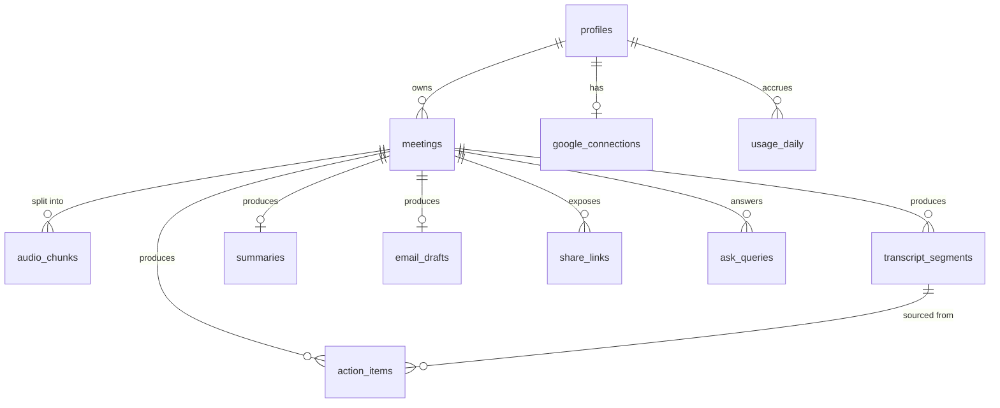

# SyncMind — Data Model

Postgres on Supabase. Every table carries `user_id` and is protected by Row Level Security; RLS is the authorization boundary, not the application layer.

## 1. Entity relationships



## 2. Enums

```sql
create type meeting_status as enum (
  'draft', 'uploading', 'transcribing', 'analyzing',
  'ready', 'failed', 'quota_blocked'
);

create type chunk_status as enum ('pending', 'uploaded', 'processing', 'done', 'failed');

create type action_status as enum ('todo', 'in_progress', 'done');

create type action_priority as enum ('low', 'medium', 'high');

create type email_tone as enum ('professional', 'friendly', 'brief');
```

## 3. Schema

### profiles

Mirrors `auth.users`, created by trigger on signup.

```sql
create table profiles (
  id            uuid primary key references auth.users(id) on delete cascade,
  email         text not null,
  full_name     text,
  avatar_url    text,
  default_tone  email_tone not null default 'professional',
  retention_days smallint not null default 7 check (retention_days between 1 and 30),
  created_at    timestamptz not null default now(),
  updated_at    timestamptz not null default now()
);
```

```sql
create function handle_new_user() returns trigger
language plpgsql security definer set search_path = public as $$
begin
  insert into public.profiles (id, email, full_name, avatar_url)
  values (new.id, new.email,
          new.raw_user_meta_data->>'full_name',
          new.raw_user_meta_data->>'avatar_url')
  on conflict (id) do nothing;
  return new;
end $$;

create trigger on_auth_user_created
  after insert on auth.users
  for each row execute function handle_new_user();
```

### meetings

```sql
create table meetings (
  id             uuid primary key default gen_random_uuid(),
  user_id        uuid not null references profiles(id) on delete cascade,
  title          text not null,
  meeting_date   date not null default current_date,
  duration_sec   integer not null check (duration_sec > 0 and duration_sec <= 7200),
  status         meeting_status not null default 'draft',
  stage_detail   text,
  error_code     text,
  error_message  text,
  resume_at      timestamptz,          -- set when quota_blocked
  chunk_count    smallint not null check (chunk_count between 1 and 24),
  language       text not null default 'en',
  pinned         boolean not null default false,  -- exempt from audio purge
  audio_purged_at timestamptz,
  created_at     timestamptz not null default now(),
  updated_at     timestamptz not null default now()
);

create index meetings_user_created_idx on meetings (user_id, created_at desc);
create index meetings_active_idx on meetings (status, updated_at)
  where status in ('uploading','transcribing','analyzing','quota_blocked');
create index meetings_purge_idx on meetings (created_at)
  where audio_purged_at is null and pinned = false;
```

`meetings_active_idx` is what the stalled-meeting sweep scans. `meetings_purge_idx` is what the retention job scans.

### audio_chunks

```sql
create table audio_chunks (
  id            uuid primary key default gen_random_uuid(),
  meeting_id    uuid not null references meetings(id) on delete cascade,
  user_id       uuid not null references profiles(id) on delete cascade,
  chunk_index   smallint not null,
  start_sec     integer not null,      -- offset of this chunk within the meeting
  duration_sec  integer not null,
  storage_path  text not null,
  size_bytes    integer,
  status        chunk_status not null default 'pending',
  attempts      smallint not null default 0,
  last_error    text,
  created_at    timestamptz not null default now(),
  unique (meeting_id, chunk_index)
);

create index audio_chunks_next_idx on audio_chunks (meeting_id, chunk_index)
  where status in ('uploaded','failed');
```

### transcript_segments

Timestamps are **absolute within the meeting** — Whisper returns chunk-relative values and the pipeline adds `audio_chunks.start_sec` before insert.

```sql
create table transcript_segments (
  id            bigint generated always as identity primary key,
  meeting_id    uuid not null references meetings(id) on delete cascade,
  user_id       uuid not null references profiles(id) on delete cascade,
  chunk_index   smallint not null,
  seq           integer not null,       -- ordering within the meeting
  start_sec     numeric(9,2) not null,
  end_sec       numeric(9,2) not null,
  speaker       text,                   -- 'Speaker 1' or a resolved name
  text          text not null,
  created_at    timestamptz not null default now(),
  unique (meeting_id, seq)
);

create index transcript_meeting_seq_idx on transcript_segments (meeting_id, seq);
create index transcript_fts_idx on transcript_segments
  using gin (to_tsvector('english', text));
```

Full-text search within a meeting:

```sql
select id, seq, start_sec, speaker, text
from transcript_segments
where meeting_id = $1
  and to_tsvector('english', text) @@ plainto_tsquery('english', $2)
order by seq;
```

### summaries

One row per meeting. Structured lists live in JSONB so the UI can render and edit them without a table per concept, while `*_md` holds the user-edited rendering that exports use.

```sql
create table summaries (
  meeting_id      uuid primary key references meetings(id) on delete cascade,
  user_id         uuid not null references profiles(id) on delete cascade,
  overview        text not null,
  topics          jsonb not null default '[]',
  -- [{ "title": str, "points": [str], "atSec": num }]
  decisions       jsonb not null default '[]',
  -- [{ "text": str, "atSec": num }]
  open_questions  jsonb not null default '[]',
  -- [{ "text": str, "atSec": num }]
  attendees       jsonb not null default '[]',
  -- [{ "name": str, "speakerLabel": str }]
  edited_by_user  boolean not null default false,
  model           text not null,
  created_at      timestamptz not null default now(),
  updated_at      timestamptz not null default now()
);
```

### action_items

```sql
create table action_items (
  id            uuid primary key default gen_random_uuid(),
  meeting_id    uuid not null references meetings(id) on delete cascade,
  user_id       uuid not null references profiles(id) on delete cascade,
  title         text not null,
  detail        text,
  owner_name    text,
  due_date      date,
  priority      action_priority not null default 'medium',
  status        action_status not null default 'todo',
  source_sec    numeric(9,2),
  source_segment_id bigint references transcript_segments(id) on delete set null,
  ai_generated  boolean not null default true,
  edited_by_user boolean not null default false,
  google_event_id text,                 -- non-null once pushed to Calendar
  position      integer not null default 0,   -- kanban ordering
  created_at    timestamptz not null default now(),
  updated_at    timestamptz not null default now()
);

create index action_items_board_idx on action_items (user_id, status, position);
create index action_items_due_idx on action_items (user_id, due_date)
  where status <> 'done' and due_date is not null;
create index action_items_meeting_idx on action_items (meeting_id);
```

`google_event_id` being non-null is what prevents double-creating a calendar event.

### email_drafts

```sql
create table email_drafts (
  meeting_id      uuid primary key references meetings(id) on delete cascade,
  user_id         uuid not null references profiles(id) on delete cascade,
  subject         text not null,
  body_md         text not null,
  tone            email_tone not null default 'professional',
  recipients      jsonb not null default '[]',   -- [str] email addresses
  gmail_draft_id  text,
  gmail_created_at timestamptz,
  edited_by_user  boolean not null default false,
  created_at      timestamptz not null default now(),
  updated_at      timestamptz not null default now()
);
```

### share_links

```sql
create table share_links (
  token             text primary key,   -- 32-byte base64url, generated app-side
  meeting_id        uuid not null references meetings(id) on delete cascade,
  user_id           uuid not null references profiles(id) on delete cascade,
  include_transcript boolean not null default false,
  view_count        integer not null default 0,
  expires_at        timestamptz,        -- null = no expiry
  revoked_at        timestamptz,
  created_at        timestamptz not null default now()
);

create index share_links_meeting_idx on share_links (meeting_id);
```

### google_connections

```sql
create table google_connections (
  user_id           uuid primary key references profiles(id) on delete cascade,
  refresh_token_enc text not null,      -- AES-256-GCM, key from GOOGLE_TOKEN_ENC_KEY
  scopes            text[] not null,
  google_email      text,
  connected_at      timestamptz not null default now(),
  last_used_at      timestamptz
);
```

Access tokens are never stored — they are exchanged per request and held in memory only.

### ask_queries

Kept for rate limiting and so a user can revisit prior answers.

```sql
create table ask_queries (
  id          uuid primary key default gen_random_uuid(),
  meeting_id  uuid not null references meetings(id) on delete cascade,
  user_id     uuid not null references profiles(id) on delete cascade,
  question    text not null,
  answer      text not null,
  citations   jsonb not null default '[]',   -- [{ "segmentId": num, "atSec": num }]
  created_at  timestamptz not null default now()
);

create index ask_queries_rate_idx on ask_queries (user_id, created_at desc);
```

### usage_daily

```sql
create table usage_daily (
  user_id         uuid not null references profiles(id) on delete cascade,
  day             date not null default current_date,
  audio_seconds   integer not null default 0,
  llm_calls       integer not null default 0,
  llm_tokens      integer not null default 0,
  asr_calls       integer not null default 0,
  primary key (user_id, day)
);
```

Incremented atomically:

```sql
insert into usage_daily (user_id, day, audio_seconds, asr_calls)
values ($1, current_date, $2, 1)
on conflict (user_id, day) do update
set audio_seconds = usage_daily.audio_seconds + excluded.audio_seconds,
    asr_calls     = usage_daily.asr_calls + excluded.asr_calls;
```

## 4. Row Level Security

Enable on every table:

```sql
alter table profiles            enable row level security;
alter table meetings            enable row level security;
alter table audio_chunks        enable row level security;
alter table transcript_segments enable row level security;
alter table summaries           enable row level security;
alter table action_items        enable row level security;
alter table email_drafts        enable row level security;
alter table share_links         enable row level security;
alter table google_connections  enable row level security;
alter table ask_queries         enable row level security;
alter table usage_daily         enable row level security;
```

Owner-only access, applied uniformly:

```sql
create policy "own profile" on profiles
  for all using (id = auth.uid()) with check (id = auth.uid());

-- Repeat this shape for: meetings, audio_chunks, transcript_segments,
-- summaries, action_items, email_drafts, share_links,
-- google_connections, ask_queries, usage_daily.
create policy "own rows" on meetings
  for all using (user_id = auth.uid()) with check (user_id = auth.uid());
```

Notes:

- Every child table stores `user_id` directly rather than joining through `meetings`. It costs one column and removes a subquery from every policy check.
- `google_connections.refresh_token_enc` is additionally encrypted at rest by the application, so a policy mistake does not leak a usable token.
- **The public share page does not use the anon key.** It runs server-side with the service-role client, which bypasses RLS, and is scoped by an explicit query: look up the token, verify `revoked_at is null` and `expires_at` is future, then read only that `meeting_id`. Nothing else is reachable.
- Service role is used in exactly three places: the share page, `/api/cron/*`, and the pipeline's storage reads. Every other server path uses the request-scoped user client so RLS still applies.

## 5. Storage

Bucket **`recordings`**, private.

```
recordings/{user_id}/{meeting_id}/{chunk_index}.webm
```

Policies:

```sql
create policy "own audio read" on storage.objects for select
  using (bucket_id = 'recordings' and (storage.foldername(name))[1] = auth.uid()::text);

create policy "own audio insert" on storage.objects for insert
  with check (bucket_id = 'recordings' and (storage.foldername(name))[1] = auth.uid()::text);

create policy "own audio delete" on storage.objects for delete
  using (bucket_id = 'recordings' and (storage.foldername(name))[1] = auth.uid()::text);
```

Uploads use signed upload URLs so the file goes browser → Supabase directly. Playback uses a signed download URL with a 1-hour TTL.

## 6. Retention

The daily sweep deletes storage objects for meetings where `created_at < now() - (retention_days || ' days')::interval`, `pinned = false`, and `audio_purged_at is null`, then stamps `audio_purged_at`. Transcripts, minutes, and action items survive — only the audio is removed. The meeting page then hides the player and shows "Audio removed after N days. Transcript retained."

## 7. Sizing against the 500 MB limit

| Item | Estimate |
| --- | --- |
| Transcript, 1-hour meeting | ~9,000 words ≈ 60 KB across ~700 segment rows |
| Summary + actions + email | ~8 KB |
| Per meeting total | **~70 KB** |
| Meetings before 500 MB | ~7,000 |

Comfortable. Storage (1 GB) binds first: a 1-hour meeting at 16 kHz mono Opus is roughly 45 MB, so ~22 unpurged hours of audio at once. The 7-day retention policy is what keeps this within limits, not an optional cleanup.

## 8. Migrations

Numbered SQL files under `supabase/migrations/`, applied with the Supabase CLI. Never edit an applied migration; add a new one.

```
0001_enums.sql
0002_profiles_and_trigger.sql
0003_meetings_and_chunks.sql
0004_transcripts.sql
0005_summaries_actions_email.sql
0006_share_google_ask_usage.sql
0007_rls_policies.sql
0008_storage_bucket_and_policies.sql
```

Types are generated into `lib/supabase/types.ts` with `supabase gen types typescript`; regenerate after every migration and commit the result.
